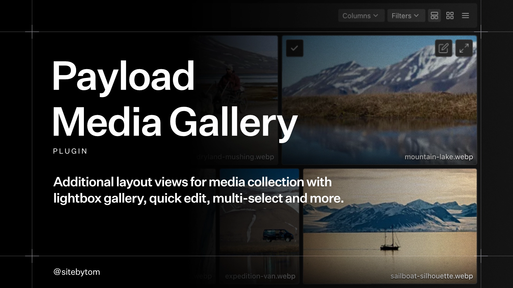

# Payload Media Gallery Plugin
A Payload CMS 3 plugin that enhances the dashboard media collection view. It adds view toggles for justified and grid layouts while keeping the original list view. Features include quick edit drawer, bulk selection and a lightbox for images, video playback, and audio files.

## Features
- **Layouts**: Toggle between **Justified**, **Grid**, and **List** views.
- **Quick Edit** via native Payload drawers.
- **Bulk Selection** with keyboard modifiers (Cmd/Ctrl/Shift + Click).
- **Lightbox**: Immersive viewer with zoom, pan, keyboard navigation, and touch support.
- **Rich Media**: Supports images, audio, and video playback with hover previews.
- **Payload-Native UI** that fits right into your dashboard.

## Installation
```bash
pnpm add @sitebytom/payload-media-gallery
```

## Usage
In your `payload.config.ts`:
```ts
import { buildConfig } from 'payload'
import { mediaGalleryPlugin } from '@sitebytom/payload-media-gallery'

export default buildConfig({
  // ...
  plugins: [
    mediaGalleryPlugin({
      collections: {
        media: true,
      },
      defaultView: 'justified', // 'justified' | 'masonry' | 'grid' | 'list'
      layouts: {
        justified: {
          enabled: true,
          footer: 'hover', // 'hover' | 'always'
        },
        masonry: {
          enabled: true,
          footer: 'hover', // 'hover' | 'always'
        },
        grid: {
          enabled: true,
          footer: 'hover', // 'hover' | 'always'
        },
      },
      lightbox: true,
      edit: true,
      disabled: false,
    }),
  ],
})
```

## Options
| Option | Type | Default | Description |
| :--- | :--- | :--- | :--- |
| `collections` | `string[] \| object` | `['media']` | Collections to enable the gallery for. |
| `defaultView` | `ViewType` | `'justified'` | The initial view mode if no preference exists. |
| `layouts` | `object` | `{}` | Configure available layouts and their footer mode. |
| `lightbox` | `boolean` | `true` | Whether to enable the lightbox gallery. |
| `edit` | `boolean` | `true` | Whether to enable the quick edit button. |
| `disabled` | `boolean` | `false` | Whether to disable the plugin. |

### Layout Configuration

The `layouts` prop allows you to enable/disable specific views or change their display settings.

```typescript
mediaGalleryPlugin({
  layouts: {
    justified: true,
    grid: {
      footer: 'always', // 'hover' (default) or 'always'
    },
    list: false, // Disable list view toggle
  },
  lightbox: true,
})
```

> ### **⚠️ Experimental**
> An "as-is" personal concept for Payload CMS. Maintenance is not guaranteed.
> * **Scope:** Works in **"All Media"** view; unsupported in **Folders**.
> * **Tested:** Payload 3.73.0 | Next.js 16.1.4 | React 19.2.3
